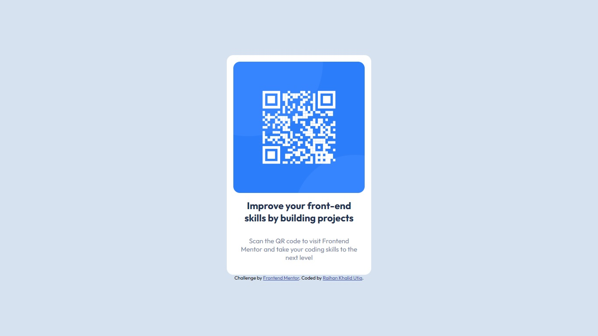

# Frontend Mentor - QR code component solution

This is a solution to the [QR code component challenge on Frontend Mentor](https://www.frontendmentor.io/challenges/qr-code-component-iux_sIO_H). Frontend Mentor challenges help you improve your coding skills by building realistic projects. 

## Table of contents

- [Overview](#overview)
  - [Screenshot](#screenshot)
  - [Links](#links)
- [My process](#my-process)
  - [Built with](#built-with)
  - [What I learned](#what-i-learned)
- [Note](#note)
- [Author](#author)

## Overview

### Screenshot



### Links

- Solution URL: [Add solution URL here](https://github.com/salvatrixx/qr-code)
- Live Site URL: [Add live site URL here](https://your-live-site-url.com)

## My process

### Built with

- Semantic HTML5 markup
- CSS
- Flexbox

### What I learned

In this project I learned how to center .container using CSS flexbox with adding this code to body:

```css
body{
  min-height: 100vh;
  display: flex;
  align-items: center;
  justify-content: center;
}
```

## Note to myself

- Using Semantic HTML for accessibility
- Use relative unit for padding, margin, width, and using rem for font-size
- Use CSS variables for font-family, font-size, and colors

## Author

-GitHub - [@salvatrixx](https://github.com/salvatrixx)
- Frontend Mentor - [@erkatia](https://www.frontendmentor.io/profile/erkatia)
- Twitter - [@salvatrix_x](https://twitter.com/salvatrix_x)
